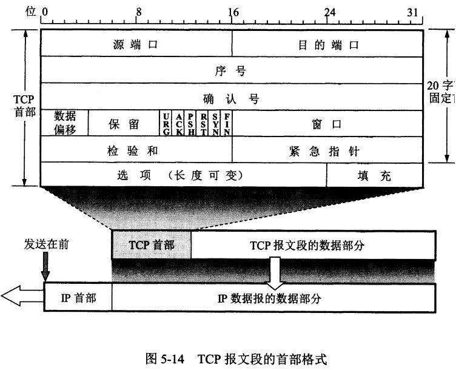

<h4>计网</h4>

**Q：OSI七层模型；以及每层有哪些协议？**

+ **物理层：**传输原始比特流，定义物理设备和网络之间的接口标准。
  + **主要协议：**以太网
+ **数据链路层：**将数据报通过单一通信链路从一个节点发送到相邻节点。将分组**封装成帧**，添加首部和尾部；**透明传输：**帧使用首部和尾部定界；**差错检测：**循环冗余CRC校验。
  + **主要协议：**
    + 点对点协议PPP
    + 高级数据链路控制HDLC
    + 地址解析协议ARP、以太网
    + Wi-Fi
    + MAC协议
    + CSMA/CD协议：载波监听多点接入/碰撞检测（多点接入:总线网络、载波监听：每个节点监听信道、碰撞检测：存在传播时延，2t争用期）
+ **网络层：**将数据包从源地址传输到目标地址，网络层向上只提供简单灵活的、无连接的、尽最大努力交互的数据报服务。把传输层传递下来的报文段或者用户数据报封装成分组。
  + **主要协议：**
    + IP协议
    + ARP协议（TCP/IP模型中属于网络层、OSI模型中属于数据链路层）
    + 网际控制报文ICMP（使主机和路由器能够发送错误信息和操作请求给其他主机或路由器，以便更好地控制IP数据包的传输）
    + 路由选择协议：
      + 自治系统内部的路由选择：
        + 内部网关协议RIP：基于距离向量的路由选择协议、**按固定的时间间隔**仅**和相邻路由器**交换自己的路由表
        + 内部网关协议OSPF：用Dijkstra算法来计算最短路径，洪泛法，所有路由器都具有全网的拓扑结构图
      + 自制系统间的路由选择：
        + 外部网关协议BGP：每个自治系统有一个BGP发言人，相邻的BGP发言人建立TCP连接交换路由信息
+ **传输层：为进程提供通用数据传输服务**，传输层提供**进程间的逻辑通信**
  + 主要协议：
    + 用户数据报协议UDP
    + 传输控制协议TCP
+ **会话层：负责建立、管理和终止会话，同时处理会话层的错误和异常情况**
  + 主要协议：
    + NetBIOS（网络基本输入/输出系统）：已被TCP/IP取代
    + RPC（远程过程调用）：允许一个计算机程序调用另一个计算机上的程序
    + SIP（会话发起协议）：用于建立、修改和终止实时会话，例如音频和视频通话。
+ **表示层：将数据表示为应用程序能够理解的格式**
  + 主要协议：ASCII、JPEG、XML等
+ **应用层：提供网络服务，满足各种应用程序的需求**
  + 主要协议：
    + HTTP
    + FTP
    + SMTP
    + POP3
    + IMAP
    + DNS
    + TELNET
    + DHCP

**Q：浏览器输入一个网页：www.youtube.com，从输入到页面显示，期间发生了什么？**

1. **域名解析1：**浏览器使用URL解析算法**将URL解析为主机名和路径**，先在**自身缓存**中查找 DNS的解析记录，如果存在，则直接返回 IP 地址；如果不存在，则查找**操作系统中的 hosts 文件**是否有该域名的 DNS 解析记录，如果有就返回。
2. **域名解析2：**如果都没有解析记录，向**本地DNS服务器**发送请求，若本地DNS服务器能解析就返回IP；否则向**根域名服务器**查询，根域名服务器返回一个**顶级域名服务器IP地址**，接着向**顶级域名服务器**查询，将返回**存有域名的权威服务器IP地址**，最后本地DNS服务器**访问该权威服务器**，得到要解析域名的IP地址。
3. **建立TCP连接：**浏览器向IP地址发送请求，**三次握手建立TCP连接**
4. **发送HTTP请求：**浏览器使用HTTP协议通过TCP连接，向服务器发送一个请求报文，服务器处理该请求，检索资源并返回相应的响应报文。如果是短连接，服务器发送响应报文后，通知TCP断开连接。
5. **加载页面资源：**解析HTML文件，如果请求的页面包含：JS文件、CSS和图像等内容，再次向服务器发送HTTP请求以获取该资源，最终将页面显示在浏览器中

**Q：UDP如何实现可靠传输？**

原理：在应用层实现TCP可靠传输的特性（序列号、ACK、超时重传、流量控制、拥塞控制）

现在的技术：QUIC、KCP、UDT等

**Q：说一下TCP三次握手，两次行不行？**

**三次握手**

**流程：**A为客户端、B为服务器端

+ 首先服务器端B处于LISTEN监听状态，等待客户端的连接请求
+ **A向B发送请求报文（第一次握手）**，SYN=1,ACK=0,选择一个初始序号seq=x
+ B收到连接请求报文，如果同意建立连接，**向A发送连接确认报文（第二次握手）**，SYN=1,ACK=1,确认号为ack=x+1，同时选择一个初始的序号seq=y。
+ A收到B的连接确认报文后，**向B发出确认（第三次握手）**，确认号为y+1，序号为x+1
+ B收到A的确认后，连接建立

**两次握手可以吗？**

不可以，第三次握手是为了：防止失效的连接请求到达服务器，让服务器错误地打开连接，客户端发送的连接请求如果在网络中滞留，那么需要很长时间才能收到服务器端发回的确认连接，而**客户端在等待一个超时重传时间后，会重新请求连接**，但**之前发送的滞留请求依然会到达服务器**，如果**不进行第三次握手，服务器会打开两个连接**；如果有第三次握手，**客户端会忽略服务器发送的对滞留连接的确认报文**，不进行第三次握手，此时不会打开连接。

**Q：TCP四次挥手**

**流程：**

+ A发送连接释放**结束报文**，**FIN=1**，序列为u**(第一次挥手)**，**ACK也是1**
+ B收到之后发出**确认**报文**(第二次挥手)**，确认号为u+1，选择一个序列v，此时TCP处于半关闭状态，B能够向A发送，但A不能像B发送数据
+ 当B不再需要连接时，发送连接释放**结束**报文**(第三次挥手)**，FIN=1，序列为w，确认号为u+1
+ A收到之后发出**确认**(序列为u+1,ack为w+1)**(第四次挥手)**，进入TIME-WAIT状态，等待2MSL(最大报文存活时间)后释放连接
+ B收到A的确认后释放连接

**三次可以吗**

如果没有第四次挥手，服务器发送完连接释放报文后，无法得知客户端是否知道数据已经发送完毕，可以关闭连接，若服务端直接关闭连接，客户端将一直保持等待接收数据状态。

**两次可以吗**

第二次挥手结束后，服务器端仍然要处理未发送完毕的数据，而客户端则一直接收数据，不知道什么时候应该关闭连接。

**为什么客户端收到第三次挥手后，进入 2MSL的TIME-WAIT状态？**

+ 确保最后一个确认报文能够到达。如果 B 没收到 A 发送来的确认报文**(第四次挥手失败)**，那么就会重新发送连接释放请求报文，A 等待一段时间就是为了处理这种情况的发生。
+ 为了**让本连接持续时间内所产生的所有报文都从网络中消失**

**Q：TCP和UDP的区别？**

+ TCP：面向连接的，通信之前需要三次握手建立连接；UDP：无连接的
  + TCP：可靠服务，数据无差错，不丢失，不重复，按序到达；UDP：尽力而为，不保证可靠交付		
  + TCP：面向字节流，将数据视作一连串无结构的字节流，数据无边界长度限制；UDP：面向报文，每个数据报有长度
+ TCP：只能一对一通信；UDP：支持一对一、一对多、多对多通信
+ TCP：有流量控制、拥塞控制、全双工通信；UDP：没有

**Q：什么时候使用TCP，什么时候使用UDP？**

A：当应用需要可靠传输和流控制时使用TCP：文件传输、邮件传输、网页浏览等—保证数据完整和正确；

当应用实时性高、数据传输量小时使用UDP：视频流传输、网络游戏、DNS查询	—要求实时性

**Q：TCP握手挥手过程中，服务器和客户端的状态转移？**

**客户端：**初始CLOSED状态，向服务器端请求建立连接转为SYN_SENT状态，收到服务器发送的ACK确认后，进入**ESTABLISHED**状态；客户端主动关闭连接请求，进入FIN_WAIT1状态，收到服务器端确认关闭报文后，进入FIN_WAIT2状态，当服务器发送连接释放结束报文时，进入TIME_WAIT状态，结束后进入CLOSED

**服务端：**初始CLOSED状态，服务启动后进入LISTEN监听状态，当收到连接请求时进入SYN_RCVD，第三次握手后，进入ESTABLISHED状态；当收到客户端结束报文时，进入CLOSE_WAIT状态，当发送连接释放结束报文时，进入LAST_ACK状态，收到第四次握手，进入CLOSED状态。

**Q：TCP如何实现可靠传输？**

通过序列号与确认应答——超时重传：TCP模块为**每个TCP报文段**都维护一个**重传定时器**：如果一个已经发送的报文段在超时时间内没有收到确认，那么就重传这个报文段。**每次重传的时间增加一倍**：超时时间 RTO 应该略大于 加权平均往返时间RTTs

**Q：讲一下TCP滑动窗口**

窗口是缓存的一部分，用来暂时存放字节流。**发送方和接收方各有一个窗口**，接收方通过 TCP 报文段中的**Window**字段**告诉发送方自己的窗口大小**，发送方根据这个值和其它信息设置**自己的窗口大小**。接收窗口的滑动类似，接收窗口左部字节已经发送确认并交付主机，就向右滑动接收窗口。

**Q：讲一下流量控制**

流量控制是为了控制发送方发送速率，保证接收方来得及接收。接收方发送的确认报文中的窗口字段可以用来控制发送方窗口大小，从而影响发送方的发送速率。将窗口字段设置为 0，则发送方不能发送数据。

**Q：讲一下拥塞控制**

因此当出现拥塞时，应当**控制发送方的速率。**TCP 主要通过四个算法来进行拥塞控制：**慢开始、拥塞避免、快重传、快恢复。**

拥塞控制算法在Linux系统下的实现：reno算法、vegas算法、cubic算法

发送方需要维护一个叫做**拥塞窗口（Congestion Window,CWND）**的状态变量，根据**网络的拥塞程度动态变化的**

发送窗口的实际值是：**通告窗口和拥塞窗口中的较小值**

**慢开始与拥塞避免**

发送的最初执行**慢开始**，令 cwnd = 1，**发送方只能发送 1 个SMSS大小报文段数据**；当收到确认后，将 cwnd 加倍，因此之后发送方能够发送的SMSS报文段数量为：2、4、8 ...，此时增长过快，**设置一个慢开始门限 ssthresh**，**当 cwnd >= ssthresh 时，进入拥塞避免**，每个轮次只将 cwnd 加 1。超时时，**令 ssthresh = cwnd / 2（但不小于2*SMSS），然后重新执行慢开始。**

**快重传与快恢复**

在接收方，**要求每次接收到报文段都应该对最后一个已收到的有序报文段进行确认。**例如已经接收到 M1 和 M2，此时收到 M4，应当发送对 M2 的确认。

+ 在发送方，**如果收到三个重复确认**，那么**可以知道下一个报文段丢失，认定为拥塞发生，此时执行快重传，立即重传下一个报文段。**例如收到三个 M2，则 M3 丢失，立即重传 M3
  + 此时：先设置**CWND = CWND/2,ssthresh = CWND**，之后设置**CWND = ssthresh + 3*SMSS**
+ /*这个时候你还能收到三个重复ACK，说明网络还没那么烂/*
+ 每次收到一个**重复确认**时，设置CWND = CWND + 1*SMSS，此时发送端允许发送下一个报文段
+ 收到了新的ACK时，令CWND = ssthresh，进入拥塞避免

**Q：什么是TCP粘包/拆包？**

一个完整的业务可能会被TCP**拆分成多个包**进行发送，也有可能把**多个小的包封装成一个大的数据包**发送，这个就是TCP的拆包和粘包问题。

##### 原因

1、应用程序写入数据的字节大小大于套接字发送缓冲区的大小，会拆包；发送方发送的数据比较小且频繁时，TCP可能会将多个小的数据包合并成一个大的数据包进行发送，粘包

2、发送方的应用程序可能会将多个小的数据包一起发送，接收方的应用程序可能会将多个接收到的数据包一起处理

3、网络延迟也可能导致TCP粘包和拆包问题的出现。当数据包的到达时间间隔比较短时，TCP可能会将多个数据包一起发送或者一起接收

4、数据大小不确定：TCP协议是基于流的传输协议，数据包的大小不固定，接收方无法知道一次性接收到的数据是否是一个完整的数据包，从而导致TCP粘包和拆包的问题。

**解决方案：**

1. 将每个数据包的长度固定为一个固定值
2. 在每个数据包之间添加特定的分隔符
3. 使用消息头来描述消息体：发送方应用程序在发送数据时，在每个数据包的头部添加一个描述信息，包括数据包的长度等信息，接收方根据头部信息进行数据包的拆分和处理。

**Q：HTTP和HTTPS区别？**

**HTTP是超文本传输协议**，是明文传输，存在安全风险，HTTPS在TCP和HTTP协议之间增加了SSL安全套接字层/TLS安全协议，使得内容加密传输；HTTPS需要TCP三次握手之后，还进行SSL/TLS握手过程，才能进行传输，HTTPS 协议需要向 CA（证书权威机构）申请数字证书。特性：信息加密、校验机制、身份证书。

**Q：HTTP请求方法**

1.0/1.1：GET—获取资源、POST—传输实体主题、HEAD—获得报文首部、PUT—传输文件、DELETE—删除文件、

1.1：CONNECT—使用隧道协议连接代理、OPTIONS—寻问支持的方法、TRACE—追踪路径

**Q：HTTP缓存？**

对于一些具有重复性的 HTTP 请求，比如每次请求得到的数据都一样的，我们可以把这对「请求-响应」的数据都**缓存在本地**

**强制缓存：**浏览器判断缓存没有过期，则直接使用浏览器的本地缓存

**协商缓存：**服务端告知客户端是否可以使用缓存

**Q：GET和POST区别**

1. get是获取数据，post是修改数据
2. get把请求的数据放在url上， 以?分割URL和传输数据，参数之间以&相连，所以get不太安全。而post把数据放在HTTP的包体内（request body 相对安全）
3. get提交的数据最大是2k（ 限制实际上取决于浏览器）， post理论上没有限制。
4. GET产生一个TCP数据包，浏览器会把http header和data一并发送出去，服务器响应200(返回数据); POST产生两个TCP数据包，浏览器先发送header，服务器响应100 continue，浏览器再发送data，服务器响应200 ok(返回数据)。
5. GET请求会被浏览器主动缓存，而POST不会，除非手动设置。
6. 本质区别：**GET是幂等的，而POST不是幂等的**

**Q：说说对称加密和非对称加密？**

HTTPS采用的是对称加密和非对称加密结合的混合加密方式。在通信建立前采用非对称加密交换会话秘钥，之后使用对称加密进行加密解密；

服务器端首先生成一对公钥和私钥，并将**公钥发送给客户端**；客户端收到公钥后，随机**生成一个对称秘钥**，将其用公钥加密，发送给服务端；服务端收到该秘钥后**用私钥进行解密**，从而完成**秘钥交换**，此后服务器与客户端均使用**对称秘钥**进行通信。

**对称加密：**只使用一个密钥，运算速度快，密钥必须保密，无法做到安全的密钥交换。**非对称加密：**使用两个密钥：公钥和私钥，公钥可以任意分发而私钥保密，解决了密钥交换问题但速度慢。

**Q：讲一下IP协议**

IP协议：为上层协议提供**无状态、无连接、不可靠**的服务。IP通信双方不同传输数据的状态信息，收发独立，无法处理乱序和重复、IP通信双方都不长久地维持对方的任何信息、不保证IP数据报准确到达接收端。当IP数据报长度**超过**帧的MTU(一般1500)时，它将被分片传输，分片可能发生在发送端、中转路由器等地

**Q：讲一下ARP协议**

ARP协议实现任意网络层地址向任意物理地址转换（主要是IP到MAC），主机向所在网络**广播一个ARP请求**，请求包含**目标的网络地址**，只有被请求的机器会回应ARP应答，其中包含自己的**物理地址**。

每个主机都有一个 <b>ARP 高速缓存</b>，里面有<b>本局域网上的各主机和路由器的 IP 地址到 MAC 地址的映射表</b>，包含：**经常访问或最近访问的机器的IP地址到物理地址的映射**。

**Q：ICMP协议**

ICMP 全称是 **Internet Control Message Protocol**，也就是**互联网控制报文协议**。主要的功能包括：**确认 IP 包是否成功送达目标地址、报告发送过程中 IP 包被废弃的原因和改善网络设置等。**分为两类：「**查询报文类型**」和「**差错报文类型**」

**Q：DHCP协议**、

通过 DHCP 动态获取 IP 地址：

过程：

+ 客户端首先发起 **DHCP 发现报文（DHCP DISCOVER）** 的 IP 数据报，使用UDP广播
+ DHCP 服务器收到 DHCP 发现报文，用 **DHCP 提供报文（DHCP OFFER）** 向客户端做出响应，携带服务器提供可租约的 IP 地址、子网掩码、默认网关、DNS 服务器以及 **IP 地址租用期**。依然广播
+ 客户端收到一个或多个服务器的 DHCP 提供报文后，选择一个向选中的服务器发送 **DHCP 请求报文**
+ 服务端用 **DHCP ACK 报文**对 DHCP 请求报文进行响应，应答所要求的参数。

**Q：IP协议/TCP协议/UDP协议首部字段**

**TCP头部（20字节固定+可变）：**

+ **端口：**告知主机报文段的源端口（来源）与目的端口（上层协议或应用程序）
+ **32位序号：**一次TCP通信中，**某个传输方向上字节流的每个字节的编号**：**第一个报文段的初始值序号为某个随机值ISN**，该传输方向（单向）**后续**报文段中的序号为：**ISN加上该报文段所携带数据的第一个字节在整个字节流中的偏移**
  + 举个例子：如果某个TCP报文段传送的数据是字节流中的第1025~2048字节，序号就是ISN+1025
+ **32位确认号：**用作对另一方**发送来的TCP报文段的响应**，为收到的**报文段序号+1**
+ **4位数据偏移：**数据部分距离报文段起始处的偏移量，实际上为首部长度，单位为32bit，所以4位最长60字节
+ **确认ACK：**当ACK=1时确认号字段有效，否则无效，TCP要求连接建立后所有传输的报文段ACK均置1，**确认报文段**
+ **同步SYN：同步报文段**，当连接建立时用来同步序号，当SYN=1，ACK=0时表示为**连接请求报文段**，若对方同意连接，**响应报文**中SYN=1,ACK=1
+ **终止FIN：**用来释放一个连接，当FIN=1时，表示数据已发送完毕，要求释放连接
+ **PSH：**接收端应用程序应立即从TCP接收缓冲区中读走数据
+ **RST：**携带RST标志的TCP报文段称为**复位报文段**，表示要求对方重新建立连接
  + 客户端访问不存在的端口/处于TIME_WAIT状态，主机将发回一个复位报文段，代表应该关闭连接
  + 异常终止一个连接：发送一个复位报文段，接受后发送端所有待发送数据都被丢弃
  + 客户端或服务器向处于半打开状态的连接写入数据，对方将回应一个复位报文段
+ **URG：**紧急指针是否有效
+ **16位窗口：**因接收方的数据缓存空间是有限的，用于**告知对方本端的TCP接受缓冲区还能容纳多少字节**的数据？接收通告窗口大小通常被设置为**接收方实际可用的缓冲区大小的一小部分**，以避免缓冲区溢出和网络拥塞：发送方可能会**一次性发送大量数据**，这会导致接收方的**缓冲区被快速填满**，从而造成丢包、拥塞等问题。而如果接收方通告的窗口大小过小，发送方就无法充分利用网络带宽，导致网络吞吐量下降。
+ **16位校验和：**发送端填充，接收端对TCP报文段执行**CRC算法**以检验TCP报文段传输中是否损坏
+ **16位紧急指针：**与序号相加表示：最后一个紧急数据的下一字节的序号
+ **选项：**最多包含40个字节

**IP头部（20字节固定+可变）：**

+ **版本** : 有 4（IPv4）和 6（IPv6）两个值；
+ **首部长度** : 占 4 位，因此最大值为 15。值为 1 表示的是 1 个 32 位字的长度，也就是 4 字节。因为固定部分长度为 20 字节，因此该值最小为 5。如果可选字段的长度不是 4 字节的整数倍，就用尾部的填充部分来填充。
+ **服务类型：**包含一个3位优先权字段（忽略）、4位TOS字段和一位保留字段(0)。四位TOS字段分别表示最小延时、最大吞吐量、最高可靠性和最小费用，最多一个置1。
+ **总长度** : IP数据报总长度。包括首部长度和数据部分长度。以字节为单位，最大2^64-1，但由于**帧MTU限制1500**，远远小于这个值

————分片信息————给IP的分片和重组提供信息

+ **标识** : 唯一地标识主机发送的每一个数据报，初始值随机，每发送一个+1，在数据报长度过长从而发生分片的情况下，相同数据报的不同分片具有相同的标识符。
+ **标志：**3位标志字段，第一位保留，第二位表示禁止分片、第三位表示更多分片MF（除最后一个数据报分片外，其他的分片均置1）
+ **片偏移** : 分片相对原始IP数据报开始处（数据部分）的偏移，和标识符一起，用于发生分片的情况。实际偏移值为该值左移3位得到，因此片偏移的单位为 8 字节，每个**IP分片的数据部分**的长度必须是8的整数倍。

————————————

+ **生存时间** ：TTL，数据报到达目的地之前允许经过的路由器条数，它的存在是为了防止无法交付的数据报在互联网中不断兜圈子。以路由器跳数为单位，当 TTL 为 0 时就丢弃数据报，向源端发送一个ICMP差错报文。
+ **协议** ：指出携带的数据应该上交给哪个协议进行处理，例如 ICMP-1、TCP-6、UDP-17 等。
+ **首部检验和** ：由发送端填充，接收端使用CRC算法检验是否损坏，因为数据报每经过一个路由器，都要重新计算检验和，因此检验和不包含数据部分可以减少计算的工作量。
+ **源地址和目标地址：**标识数据报的发送端和接收端IP，一般在整个传递过程中不变
+ **可选字段：**最多包含40个字节：包含一些IP选项：记录路由、时间戳、松散路由选择、严格路由选择
+ **数据部分：**最多1500(MTU)-20(头部)=1480字节

**UDP头部8字节**

+ **源端口**（2字节）：指发送端口号，用于标识发送方的应用程序。

+ **目标端口**（2字节）：指接收端口号，用于标识接收方的应用程序。

+ **长度**（2字节）：指UDP数据报的长度，包括头部和数据部分，以字节为单位。最小值为8字节，因为UDP头部长度为8字节。

+ **校验和**（2字节）：用于检测UDP数据报是否有误或被篡改。计算校验和时，包括UDP头部和数据部分。

**Q：UDP最大能传输多少字节？**

受限于以太网帧MTU大小，一般为1500字节，所以UDP报文最大大小一般为（MTU1500-IP头部20-UDP头部8） = 1472字节

**Q：HTTP常见字段**

+ **Host：**服务器域名
+ **Content-Length：**表明本次回应的数据长度
+ **Connection 字段：**是否使用长连接
+ **Content-Type 字段：**回应的文本是什么格式

**Q：HTTP状态码?**

+ 1xx：提示信息，表示还需要后续操作
+ 2xx：表示服务器成功处理客户请求
  + 200 OK：一切正常
  + 204 No Content：响应头无Body
+ 3xx：重定向
  + 301：永久重定向
  + 302：临时重定向
  + 304：资源未修改，允许使用缓存
+ 4xx：客户端错误
  + 400 Bad Request：客户端报文出错
  + 403 Forbidden：服务器禁止访问资源
  + 404 Not Found：请求资源不存在
+ 5xx：服务端错误
  + 500 ：服务器内部错误
  + 501：功能不支持
  + 502 Bad GateWay：服务器作为网关或代理后端服务器错误
  + 503 Service Unavailable：服务器繁忙